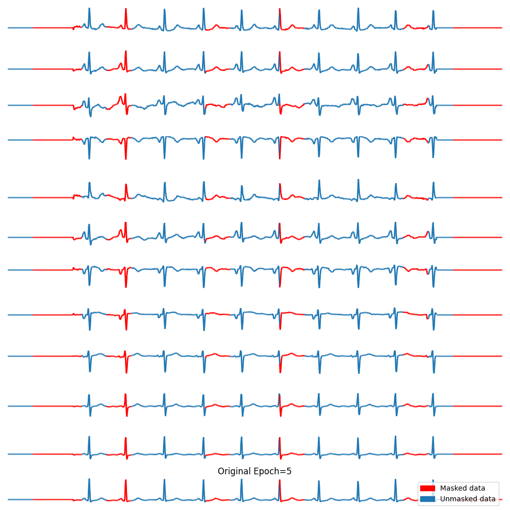
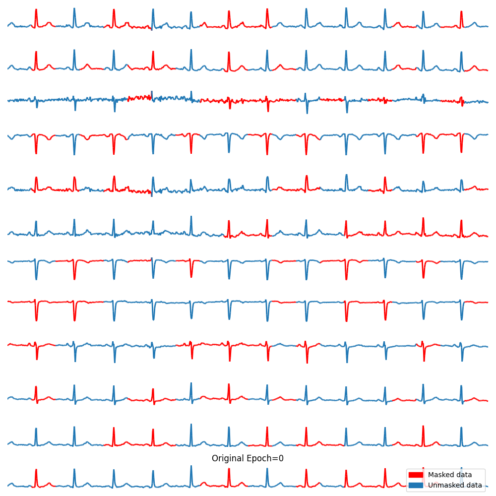
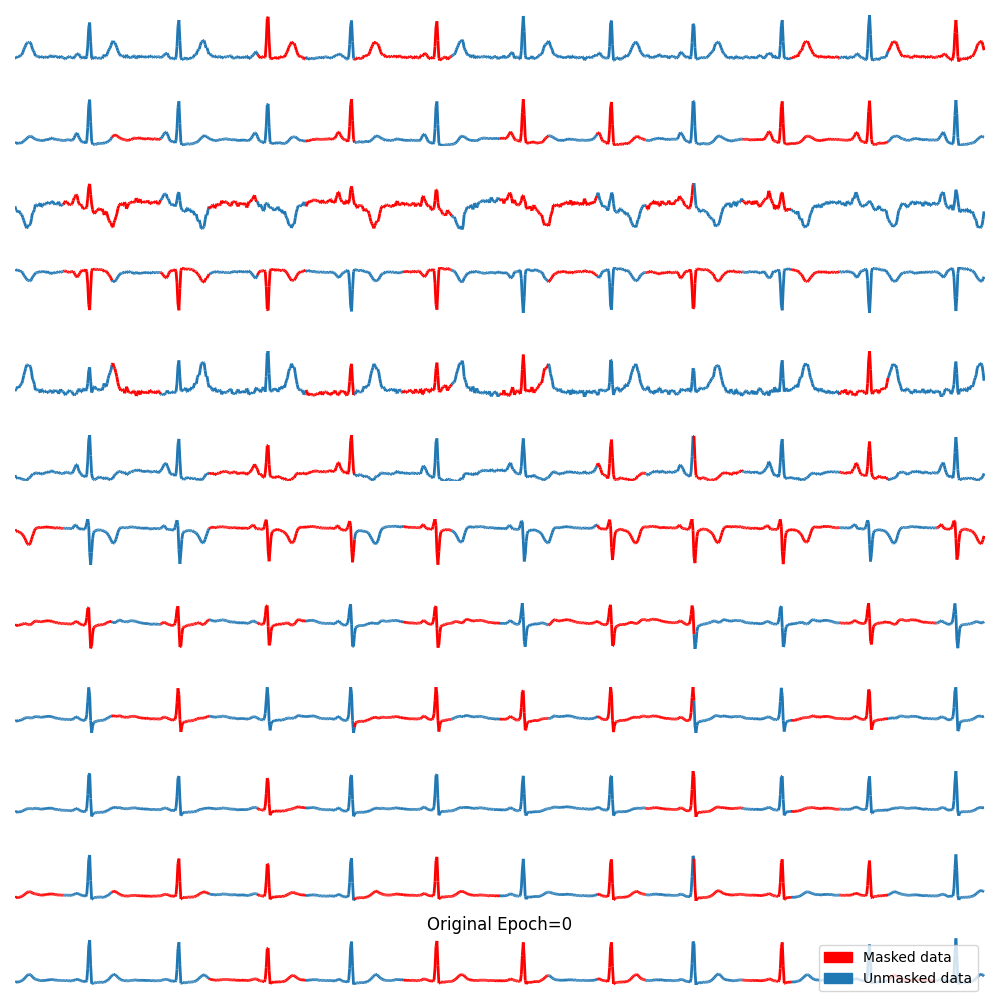
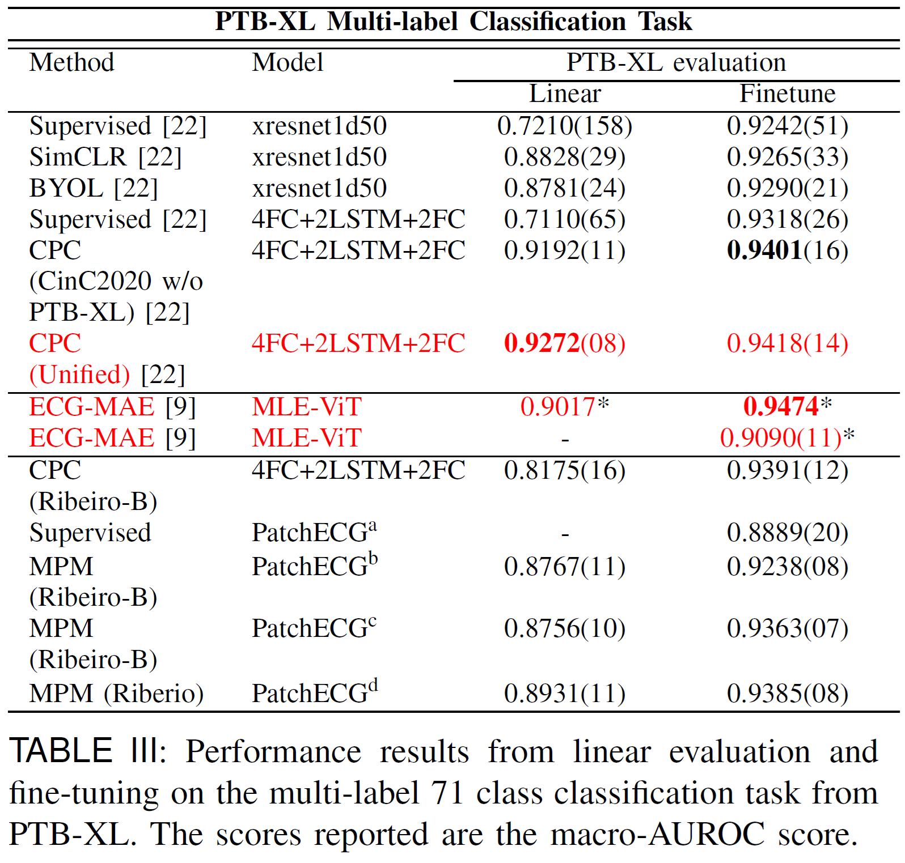
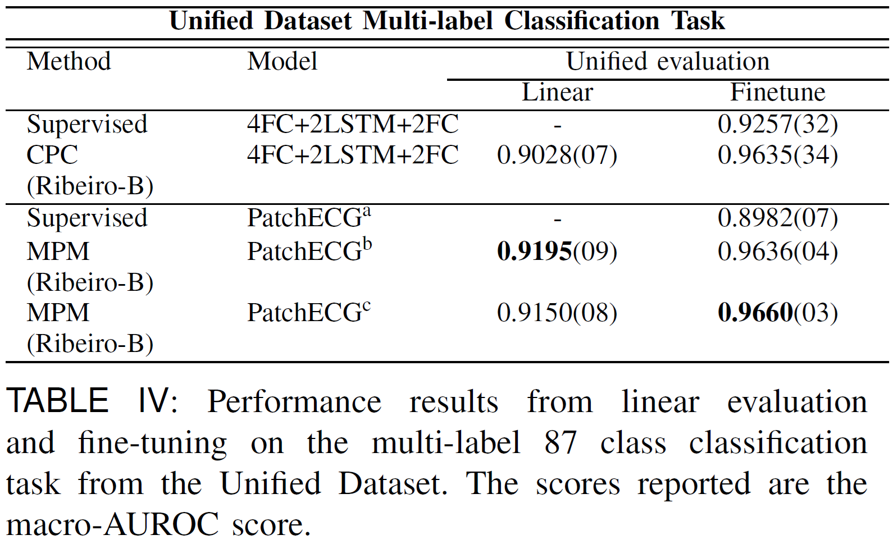
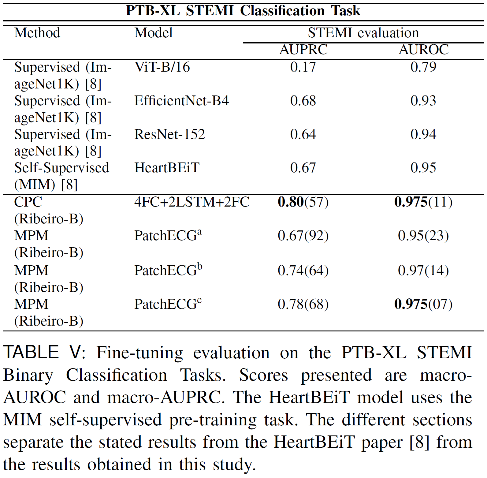
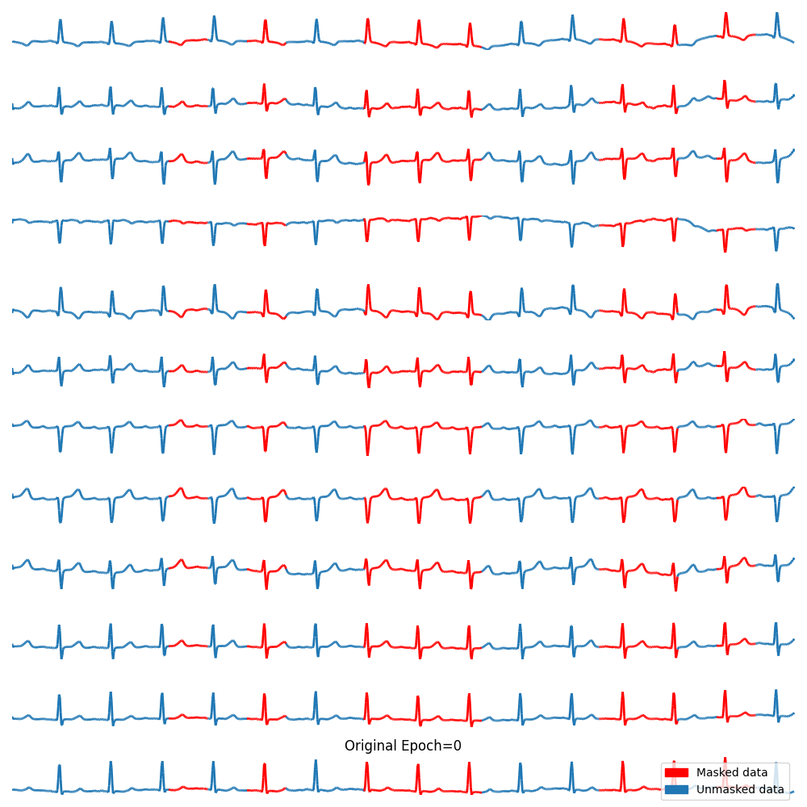
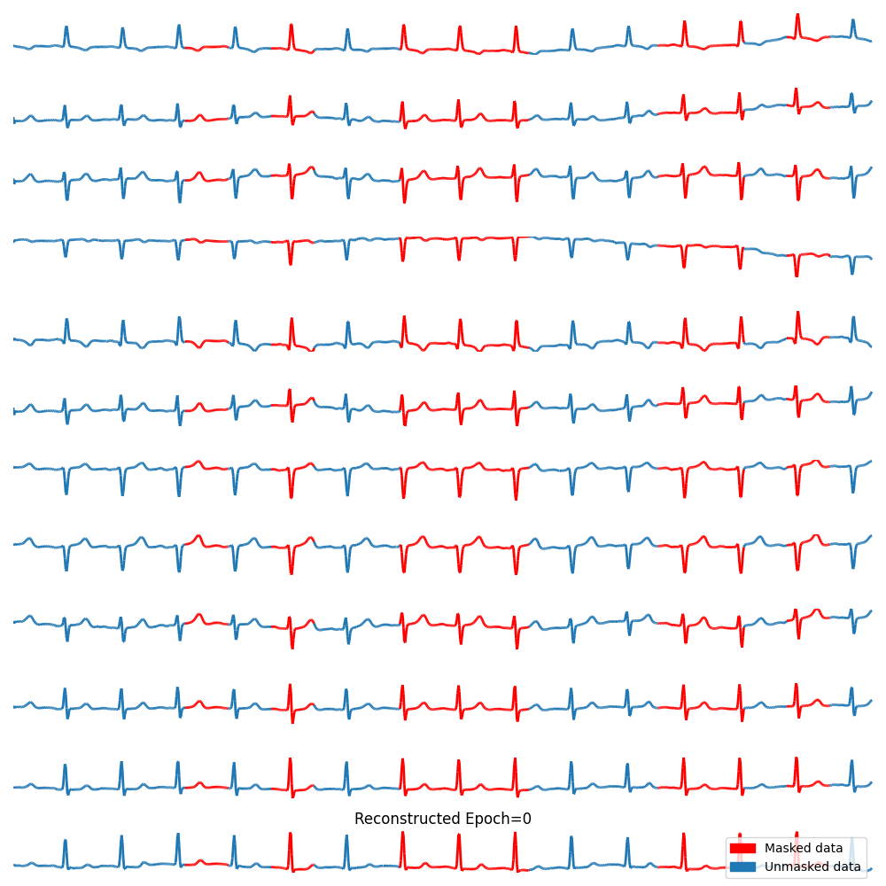
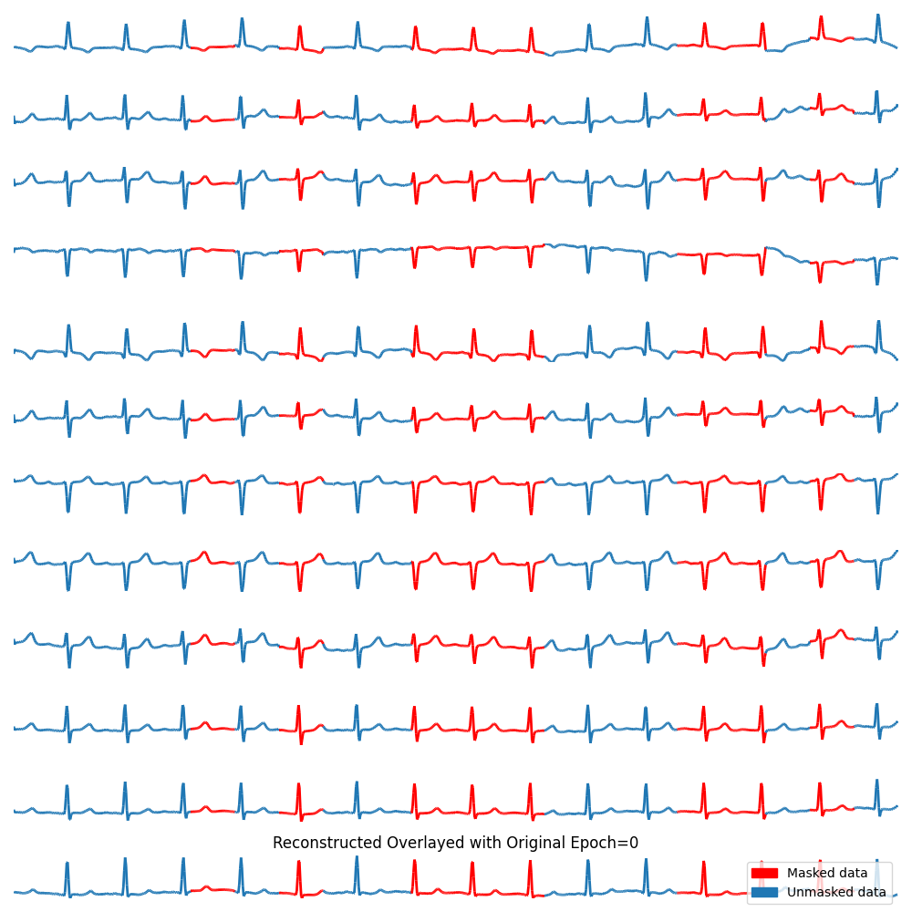

# Toward Robust Automated Cardiovascular Arrhythmia Detection using Self-supervised Learning and 1-Dimensional Vision Transformers
***

This is the official code repository accompanying our paper titled **[Toward Robust Automated Cardiovascular Arrhythmia Detection using Self-supervised Learning and 1-Dimensional Vision Transformers](https://www.techrxiv.org/doi/full/10.36227/techrxiv.172866031.13011158).**

For a detailed description of technical details and experimental results, please refer the publication.

This work is also meant to support a wide range of use cases and serve as foundation for future work in the field.
For this purpose, the codebase has been designed with layers of abstraction to ensure future work can benefit from its generality.

All scripts were created for the [Narval Cluster - Digital Alliance Canada](https://docs.alliancecan.ca/wiki/Narval/en) and use
SLURM scheduler by default. To use the scripts, replace the arguments `#SBATCH --account=def-x` and `/path/to/` with the correct
account and path information.

# Contributions and Key Designs
***

## Contributions
The largest publicly available model to date (85.3 million parameters), pre-trained on 8 million unlabelled ECG samples 
from the Ribeiro dataset. The provided foundational model can be fine-tuned to any task leveraging ECG data.

## Architecture

*Overview of PatchECG and Masked Patch Modelling (Only 6 of the original 12 leads are shown due to size constraints). 
(1) The original ECG signal is broken up into patches of length 50 by default. (2) The signal is partitioned into patches; 
by default, 40\% of the patches are masked (red), and the rest are left unmasked (blue). (3) Patches are linearly 
projected to the model dimension $d_{model}$ using a linear embedding. During pre-training, masked patches are replaced 
with a learnable mask token $\textbf{[\text{M}]}$. They are then fed into the Transformer backbone. (4) The task-specific 
MLP $g$ is trained to reconstruct the corrupted patches based on the output of the Transformer. (5) The entire signal is 
reconstructed from the corrupted input. The difference between an early reconstruction (top) and a late reconstruction 
(bottom) shows the progress of the PatchECG model in learning a robust representation of ECG data. (6) The pre-trained 
backbone network is used, without masking, for fine-tuning and inference by replacing the pre-training head $g$ with a 
new task-specific MLP $f$.*

## Multiple types of masking
In each pre-training batch we include three types of masking to ensure the model learns a robust representation of ECG data


|       Standard Per-lead Masking       |      Per-lead Randomized Masking      |    All-lead Randomized Masking     |
|:-------------------------------------:|:-------------------------------------:|:----------------------------------:|
|  |  |  |


# Results
***

## Results on PTB-XL


## Results on Unified Dataset (CINC-2020 and Chapman-Shaoxing Datasets)


# Results on STEMI (PTB-XL)


# Efficiency and Capacity
***


# Pre-processing
***

## Preparation
1. Install dependencies from `requirements.txt` by running `pip install -r -r /path/to/requirements.txt`.
2. Download the data from the various datasets including: [PTB-XL (version 1.0.2 and 1.0.3)](https://physionet.org/content/ptb-xl/1.0.3/), 
[Chapman](https://physionet.org/content/ecg-arrhythmia/1.0.0/), [CinC-2020](https://physionet.org/content/challenge-2020/1.0.2/), 
and [MIT-BIH Noise Stress Test Database](https://www.physionet.org/content/nstdb/1.0.0/). Access to the Ribeiro dataset
is available [here](https://antonior92.github.io/datasets). By default, only 15% of the dataset is publicly available,
to gain access to the entire dataset permission must be granted by the dataset owner.


## Data Pre-processing (Ribeiro/CODE)
1. Create a folder a for the Ribeiro/CODE dataset with the following hierarchy  
.  
├── CODE  
├   ├── training  
├   ├   ├──  s0000000.tar.gz  
├   ├   ├── .  
├   ├   ├── .  
├   ├   ├── .  
├   ├   ├── s4410000.tar.gz  
├   ├── annotations.csv  
├   ├── records.txt

2. Place all data files `ex: s0000000.tar.gz` inside the `training` directory. Run the following command in the directory to unzip the files:
`gunzip *.gz`.

3. The Ribeiro dataset will take a very long time to pre-process compared to the other datasets. I recommend running the
the following script for the Ribeiro dataset alone: `src/scripts/unification/resample/resample_100.sh`. The script will need to be modified to include the correct path to the Ribeiro dataset. By default, the
resample rate is `100Hz` and the resample time window is `10 seconds`. These defaults can be changed with the following arguments:
`--resample_freq` and `--time_window`.


## Data Pre-processing (All)
1. To pre-process the PTB-XL dataset run the script `resample_ptb_xl.sh`. Make sure to include the correct path to the PTB-XL data folder.
2. To pre-process and unify the Chapman and CINC-2020 datasets run the script `unify_datasets.sh`. Again make sure that the paths to the datasets are correct.
Also define the path to the new Unified_Dataset that will be generated by running the script.
3. The resample frequency and time window can again be modified through the following arguments:
`--resample_freq` and `--time_window`.


## Pre-training
***

### Multi-GPU
By default, all scripts are set up to make use of multiple GPUs leveraging the [Distributed Data Parallel](https://pytorch.org/tutorials/intermediate/ddp_tutorial.html)
framework. The default resource allocations are specific to the [Narval Cluster - Digital Alliance Canada](https://docs.alliancecan.ca/wiki/Narval/en).

### Multi-Node
In the event that you would like even more computing power, the scripts are set up to handle execution on multiple nodes.
Look at the scripts in the following path for a basic example: `src/scripts/multi-node`. The main aspects to copy from
this script are `--init_method` and `--world_size` arguments. Also make sure to increase the number of nodes in the slurm
arguments `#SBATCH --nodes=<number of nodes>`. More information can be found [here](https://docs.alliancecan.ca/wiki/Technical_documentation).

### Default Pre-training

Default pre-training scripts can be found in the `src/scripts/multi-gpu/pretrain` directory. Default arguments are included with the preset scripts,
however, there are many other arguments that may be of use to future research. These include: `--noise_masking`,
`--trafos`, `--clip_grad`, etc. It is also possible to include a pre-trained model and continue pre-training on a new dataset.
Leveraging methods such as [Self-Supervised Pretraining Improves Self-Supervised Pretraining](https://arxiv.org/abs/2103.12718).

The program will output a saved model at regular intervals defined by `--save_every=n`, and a different model whenever it obtains a better performance metric.
Training and validation metrics for each gpu will also be updated after each epoch and saved in csv files. The default save path for 
all files is `results/pre-train/saved_models/<dset_pretrain>/<model_name>/`. If using one of the default Transformer models, 
the program will also output a plot at regular intervals for manual interpretation. There are three separate plots:
the original, the reconstruction, and the reconstruction overlayed with the original. The following examples are single-shot reconstructions from the PatchECG model
pre-trained on Ribeiro and applied to the Unified Dataset to test hierarchical pre-training.

|             Original             |            Reconstruction             |            Reconstruction Overlayed with Original             |
|:--------------------------------:|:-------------------------------------:|:-------------------------------------------------------------:|
|  |  |  |

## Fine-tuning
***

### PTB-XL dataset Multi-label classification


### PTB-XL dataset ST-Elevation Myocardial Infarction (STEMI)


### Unified Dataset Multi-label classification
To ensure the same train, validation and test splits are used between runs when fine-tuning on the Unified Dataset, run 
the script: `src/scripts/multi-gpu/finetune/multi_label/unified/generate_splits.sh`. This will generate 10 different stratification folds
in a folder titled `Unified_Test_Runs`. Make sure to include the path to this folder in your subsequent experiments.

## Confidence Intervals
***
To run confidence intervals after a model has been fine-tuned, modify the fine-tuning script such that `--no-bootstrapping` is now `--bootstrapping`. You may need to decrease
the number of iterations so that it is able to run within a given time window and accumulate the runs manually. You may also wish to comment out the loop and select only a subset of models on which to perform confidence intervals.

After the script has completed, the program will output two files into the same folder as the fine-tuned model: `auroc_auprc_scores.csv` 
and `confidence_bounds.csv`. The first file will list all AUROC and AUPRC scores recorded during the trials. The second file
will list the mean and the upper and lower quantile bounds according to a 95% confidence interval.

## Hyperparameter Tuning
***
To perform hyperparameter tuning you must manually define the parameters, this can be done in the `patchECG.py` file in the `config` dictionary. 
Admittedly this section is not so easily modified and will require that you modify the code to include the parameter selection. 
For example, searching for `config['lora_dropout']` will demonstrate how these parameters must be included.
More information about raytune is available [here](https://docs.ray.io/en/latest/tune/index.html).

To execute hyperparameter tuning, run the script `src/scripts/multi-gpu/hyperparameter_tuning/patch_ecg_hp_tuning.sh`.


## General Structure of the Codebase
***

## Adding new Datasets
***

## Adding new models
***

# Citation
***
If you find this repo useful in your research, please consider citing our paper as follows:
```
@article{chatterjee2024toward,
  title={Toward Robust Automated Cardiovascular Arrhythmia Detection using Self-supervised Learning and 1-Dimensional Vision Transformers},
  author={Chatterjee, Mitchell and Chan, Adrian and Komeili, Majid}
}
```